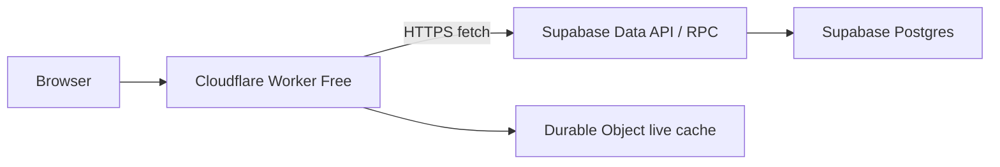

# Worker Supabase Data API Phase 1 Design

## Goal

Make the project usable on Cloudflare Workers Free without a database proxy by moving the first-screen public reads and admin login off direct Postgres TCP and onto Supabase HTTPS Data API/RPC.

## Scope

Phase 1 migrates only the routes needed to open the app and log in:

- `GET /api/public`
- `GET /api/clients`
- `GET /api/nodes`
- `GET /api/task/ping`
- `GET /api/websites`
- `GET /api/public/bootstrap`
- `POST /api/login`
- `GET /api/me` only where it validates a session after login

Phase 1 does not migrate:

- Agent report/write routes.
- Cron jobs.
- Admin CRUD after login.
- Backup/restore.
- Website check writes.
- Full Postgres provider removal.

Those stay on the existing SQL layer for now. They may still fail on Workers Free until later phases, but the public first screen and login stop using TCP Postgres.

## Architecture

Add a small Supabase REST/RPC client inside the Worker using native `fetch`. Do not add `@supabase/supabase-js`; the Worker only needs a few HTTP calls and the native API is enough.

The Worker uses two new secrets:

- `SUPABASE_URL`, for example `https://PROJECT_REF.supabase.co`
- `SUPABASE_SERVICE_ROLE_KEY`, stored only as a Cloudflare secret

The key is never sent to browsers. Frontend code continues calling the Worker only.

Data flow:

## Database API Shape

Use RPC functions for Worker-facing reads instead of exposing raw tables. Put functions in an API-exposed schema only if required by Supabase Data API settings, and grant execute only to `service_role`.

Required RPC functions:

- `cfm_public_settings()`
  - Returns the same JSON shape currently produced by `buildPublicSettings`.
- `cfm_public_clients()`
  - Returns public client rows with hidden/token fields excluded.
- `cfm_public_ping_tasks()`
  - Returns ping tasks filtered into public-safe shape.
- `cfm_public_websites(period_hours int, check_limit int)`
  - Returns public website monitors with recent checks.
- `cfm_login_user(username text)`
  - Returns one user row needed by Worker-side password verification:
    - `uuid`
    - `username`
    - `passwd`
    - `session_version`
- `cfm_validate_admin_session(user_uuid uuid, session_version int)`
  - Returns the current session user if the session version still matches.
- `cfm_ensure_initial_admin(username text, passwd text)`
  - Inserts the initial admin only when `users` is empty.
  - The Worker still hashes `ADMIN_PASSWORD` before calling this RPC.

The login RPC must not verify passwords in SQL. Password verification stays in Worker code so the existing hash format and rehash logic remain unchanged.

## Worker Changes

Create one focused helper:

- `worker/src/db/supabase-api/client.ts`

Responsibilities:

- Build Supabase REST/RPC URLs.
- Send `apikey` and `Authorization: Bearer ...` headers.
- Throw sanitized errors for non-2xx responses.
- Provide typed helpers for the small Phase 1 RPC set.

Modify public routes so Phase 1 routes can use Supabase API when configured:

- If `SUPABASE_URL` and `SUPABASE_SERVICE_ROLE_KEY` exist, use Data API/RPC.
- Otherwise use the existing Postgres provider.

This keeps local development and the current direct mode working while enabling Free Worker deployment.

Modify login/session validation:

- `POST /api/login` calls `cfm_ensure_initial_admin` before lookup when Data API mode is enabled.
- `POST /api/login` reads user via `cfm_login_user`.
- Worker keeps rate-limit checks in Durable Object/local memory first.
- Audit writes remain best-effort SQL in Phase 1; failure must not break successful login.
- `GET /api/me` validates JWT locally and uses Cache API / edge session cache first. If DB validation is needed, call `cfm_validate_admin_session`.

## Security

Required rules:

- Do not expose `SUPABASE_SERVICE_ROLE_KEY` to frontend assets or responses.
- Do not grant broad table access to `anon`.
- Prefer RPC functions over direct table REST access.
- Keep password verification in Worker.
- Keep CSRF logic unchanged.
- Logins must still rate-limit failed attempts.
- SQL functions using `SECURITY DEFINER` must live in a controlled schema, have fixed `search_path`, and grant execute only to `service_role`.

After deployment, rotate secrets that appeared in chat:

- Supabase database password.
- `DATABASE_URL`.
- `JWT_SECRET`.
- `ADMIN_PASSWORD`.

## Error Handling

Supabase API failures should return the same route-level shape as current DB failures:

- Public read failures return HTTP `500` with a generic message.
- Login user lookup failures return `401` for bad credentials.
- Supabase API configuration missing falls back to existing Postgres mode.
- Supabase API non-2xx details are sanitized before logging.

## Testing

Add small source-level tests, matching this repo's current test style:

- Supabase API client sends required headers and redacts secrets in errors.
- Public routes contain Data API fallback gates.
- Login route still verifies password in Worker, not SQL.
- Service role key is not referenced in frontend files.
- RPC migration SQL grants execute only to `service_role`.

Manual verification for `cf-monitor2`:

- `/ping` returns 200.
- `/api/version` returns 200.
- `/api/public` returns 200.
- `/api/public/bootstrap` returns 200.
- Login succeeds with the configured admin account.
- `/api/me` returns the user after login.

## Later Phases

Phase 2:

- Move login failure persistence and audit writes to RPC.
- Move admin low-risk reads to RPC.

Phase 3:

- Move website monitor writes to RPC.
- Move Agent batch writes to RPC.
- Move Cron cleanup to RPC.

Phase 4:

- Remove direct Postgres from Worker Free deployments.
- Keep SQL migrations/local bootstrap as an external setup path.
